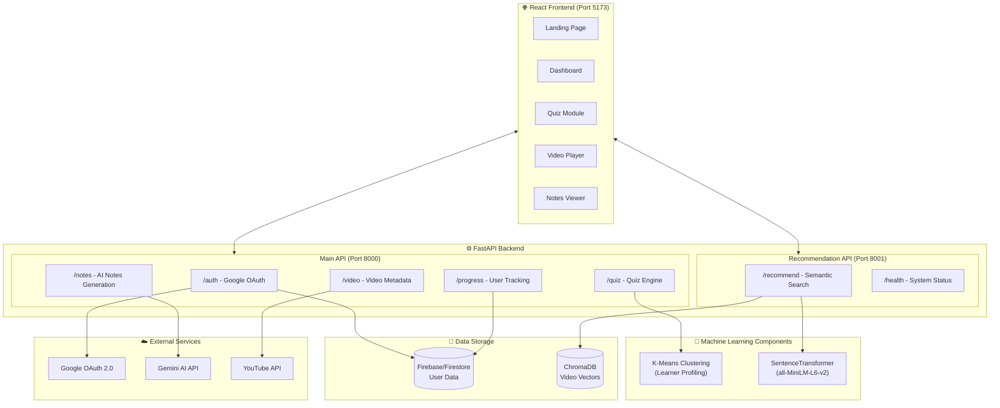
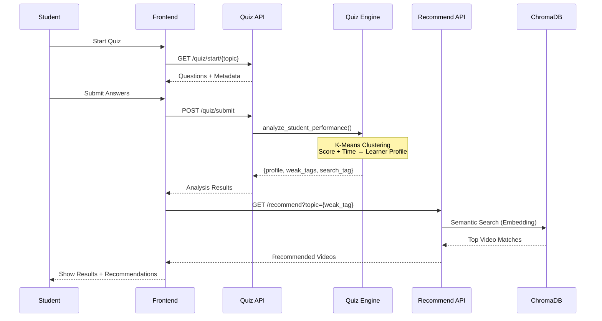
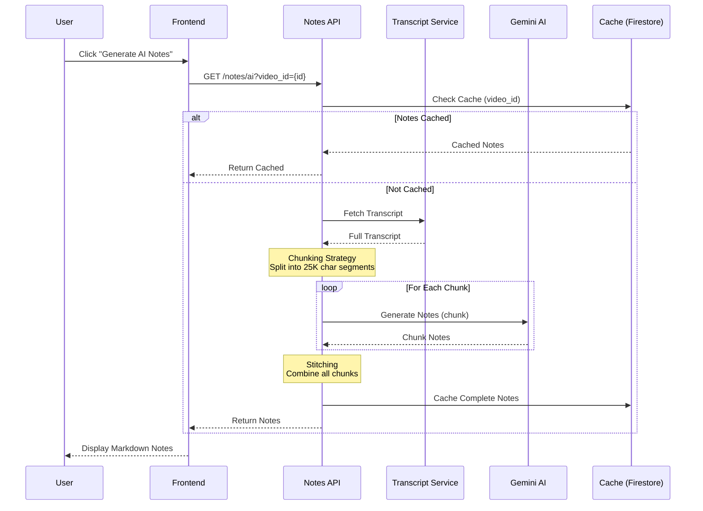
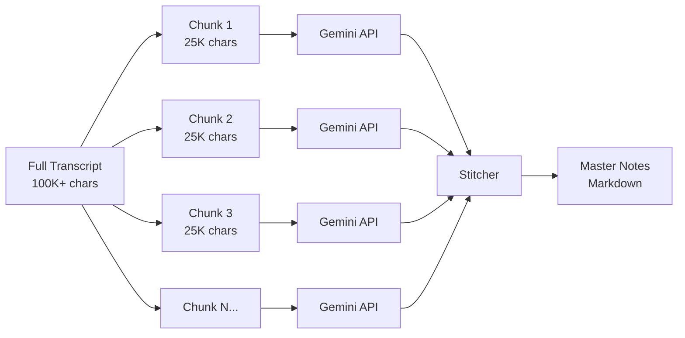
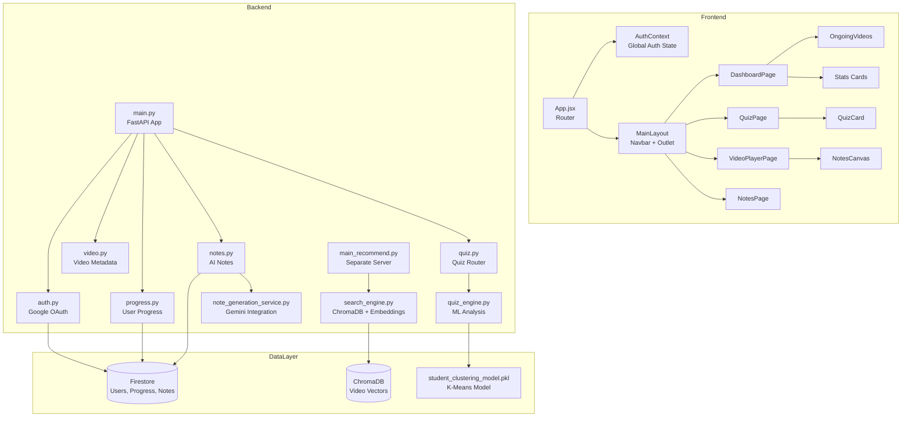
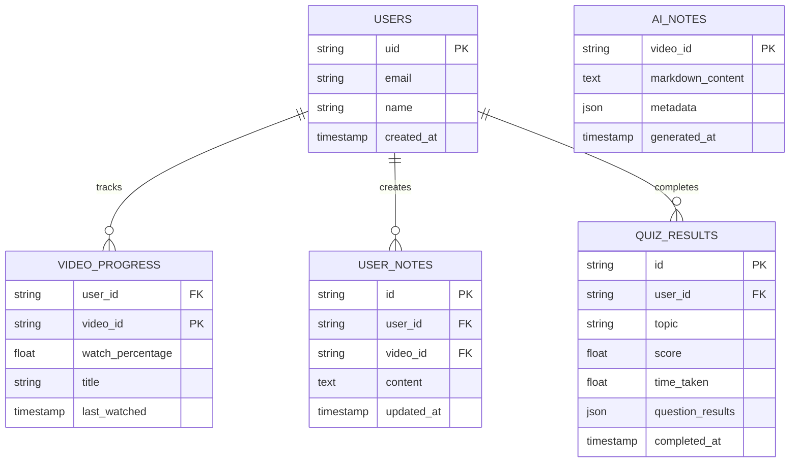

# Thinkly - Architecture & Technical Deep Dive

A comprehensive analysis of the Adaptive Learning Platform codebase, including system architecture, data flows, key algorithms, and project novelty.

---

## System Architecture Overview



---

## Data Flow Diagrams

### 1. Quiz → Analysis → Recommendation Flow



### 2. AI Notes Generation Flow



---

## Key Algorithms & Technical Novelty

### 1. 🎯 K-Means Learner Profiling (Unsupervised ML)

**Location:** `backend/app/train_model.py` + `backend/app/quiz_engine.py`

**Algorithm:**
```python
# Feature Vector: [normalized_score, normalized_time]
# Clusters into 3 profiles:
#   - "Struggling" (low score, high time)
#   - "Rushed" (low score, low time)  
#   - "High Achiever" (high score, moderate time)
```

**Novelty:**
- Combines **score** AND **time-per-question** to detect nuanced learner states
- A student with 50% score who took 5 seconds/question (rushed) gets different content than one who took 60 seconds/question (struggling with concepts)
- Profile-specific search tags are generated to find appropriate difficulty videos

---

### 2. 🔍 Semantic Search with ChromaDB (Content-Based Filtering)

**Location:** `backend/app/search_engine.py`

**Algorithm:**
```python
# 1. Embed user query using SentenceTransformer
query_embedding = model.encode("binary search time complexity")

# 2. Query ChromaDB for nearest neighbors
results = collection.query(
    query_embeddings=[query_embedding],
    n_results=5,
    where={"difficulty": "Beginner"}  # Optional metadata filter
)
```

**Novelty:**
- Videos are pre-indexed by transcript chunks (offline factory)
- Supports **metadata filtering** (difficulty, style, granularity)
- Fallback logic when no exact matches found
- Returns specific timestamp ranges within videos, not just video IDs

---

### 3. 📝 Divide-and-Conquer Notes Generation (LLM Chunking)

**Location:** `backend/app/note_generation_service.py`

**Architecture:**


**Novelty:**
- Handles **multi-hour lecture videos** that exceed LLM context limits
- **Overlapping chunks** (500 char overlap) prevent mid-sentence breaks
- Smart break-point detection (finds sentence endings)
- Rate limiting built-in for API quotas
- College-level prompt engineering for high-quality study notes

---

### 4. 🏷️ Micro-Tag Analysis (Question-Level Insights)

**Location:** `backend/app/quiz_engine.py` (lines 225-251)

```python
def _analyze_micro_tags(results, questions):
    """
    Calculates accuracy percentage for each micro-tag.
    Example output: {"Theory": 80%, "Syntax": 20%, "Time Complexity": 60%}
    """
```

**Novelty:**
- Goes beyond topic-level analysis to **sub-topic granularity**
- Questions are tagged with micro-concepts (e.g., "pointer manipulation", "edge cases")
- Generates targeted recommendations for specific weak areas

---

## Component Architecture



---

## Database Schema



---

## Project Uniqueness & Innovation

| Feature | Traditional LMS | Thinkly's Approach |
|---------|----------------|-------------------|
| **Learning Analysis** | Basic pass/fail | ML clustering with time + score behavioral analysis |
| **Recommendations** | Manual playlists | Semantic search over transcript embeddings |
| **Note Generation** | None | LLM-powered with chunking for any video length |
| **Personalization** | One-size-fits-all | Profile-specific content (Struggling vs Rushed vs Achiever) |
| **Video Integration** | External links | In-app player with progress tracking + transcript sync |

### Technical Differentiators:

1. **Hybrid ML Pipeline**: Combines unsupervised clustering (K-Means) with semantic retrieval (embeddings)
2. **Scalable LLM Integration**: Chunking strategy handles videos of any length without token limit issues
3. **Real-time Adaptation**: Quiz results immediately influence video recommendations
4. **Offline + Online Architecture**: Pre-computed embeddings (offline factory) + real-time queries

---

## Tech Stack Summary

| Layer | Technology |
|-------|------------|
| Frontend | React 18, Vite, TailwindCSS, Framer Motion |
| Backend | FastAPI, Python 3.11, Uvicorn |
| ML/AI | scikit-learn (K-Means), SentenceTransformers, Google Gemini |
| Vector DB | ChromaDB (persistent mode) |
| Auth | Google OAuth 2.0, Firebase Auth |
| Storage | Firebase Firestore |
| External | YouTube Data API, YouTube Transcript API |
