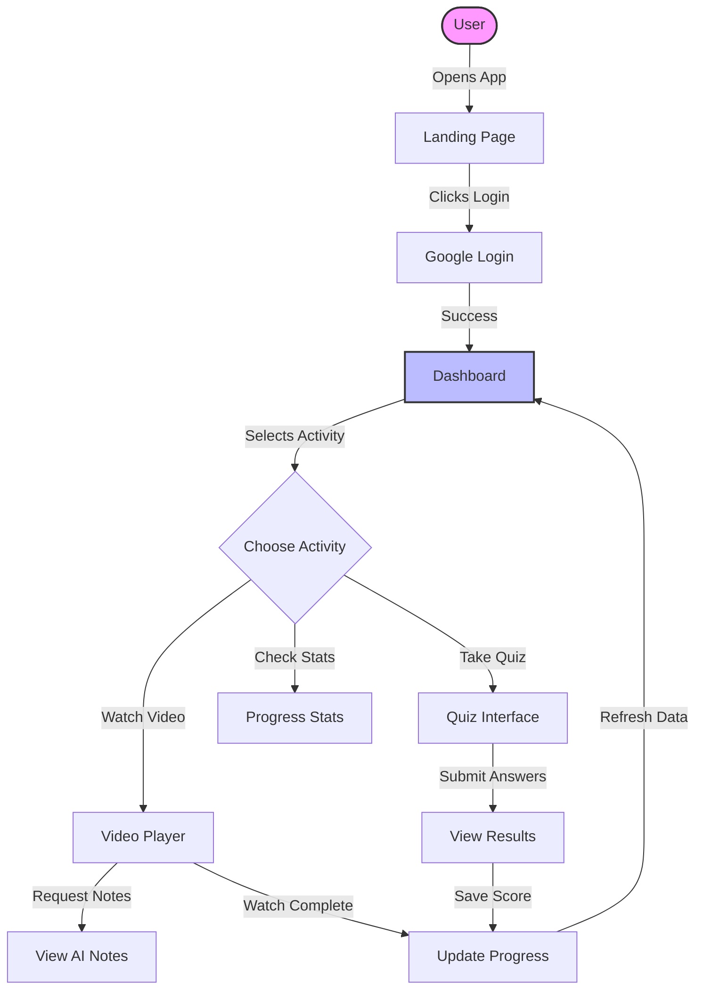
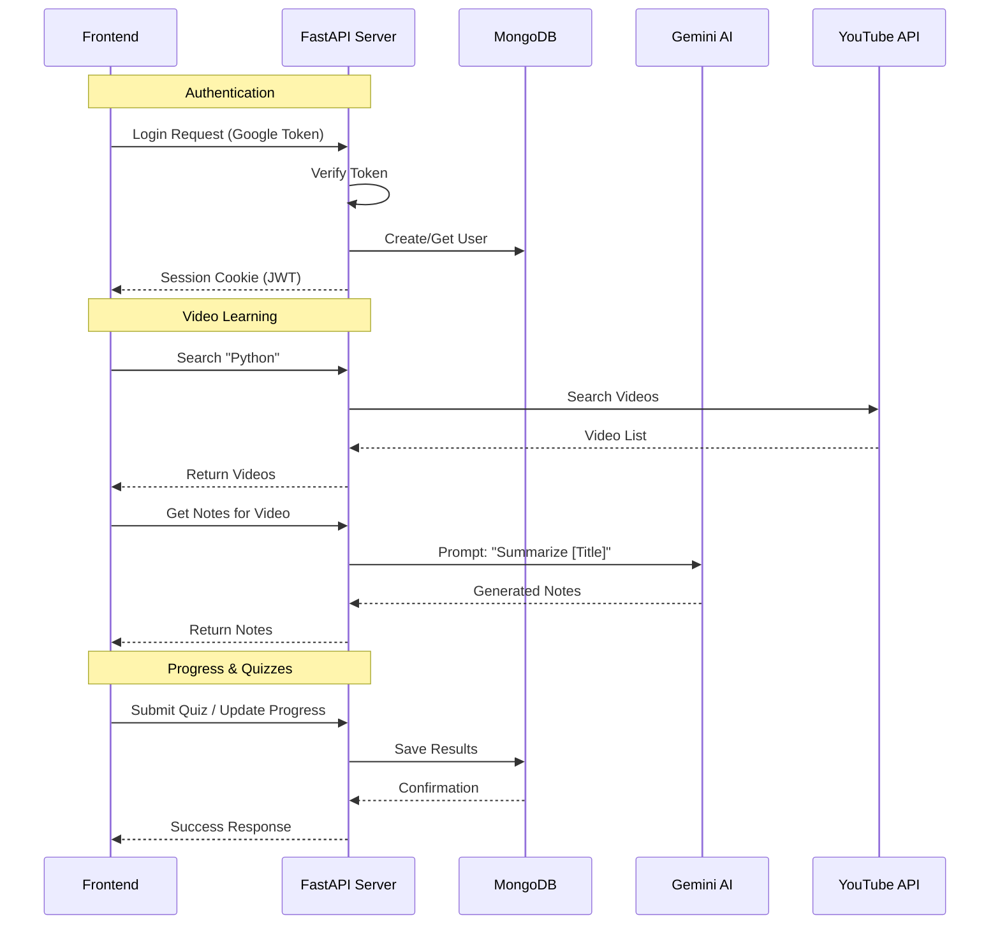
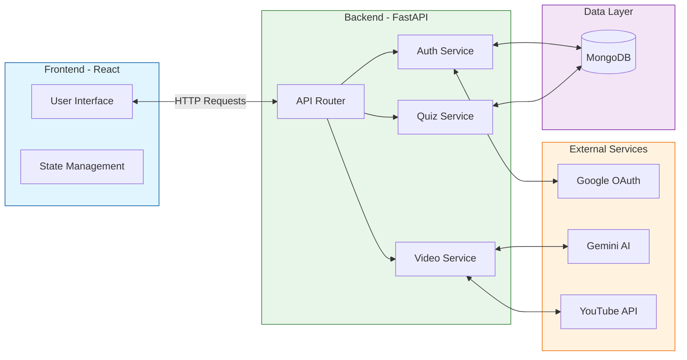

# System Architecture Diagrams

Use these diagrams to visualize how your Adaptive Learning Platform works. You can render these using a Mermaid viewer or online at [mermaid.live](https://mermaid.live).

## 1. Frontend Flow (User Experience)
This diagram shows how the user interacts with the website.

## 2. Backend Flow (Logic & Data)
This diagram shows how the server handles requests.

## 3. Combined System Architecture
This diagram shows the entire system connecting together.

